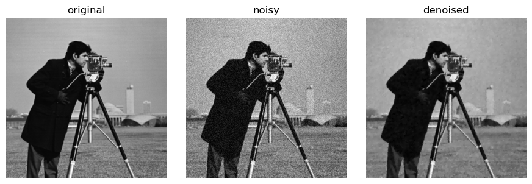
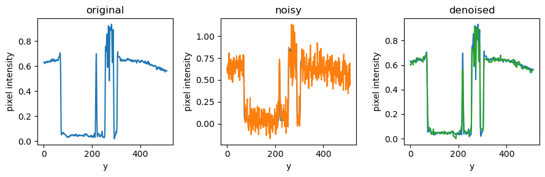

# TVImageFiltering.jl
[](https://github.com/urlicht/TVImageFiltering.jl/actions/workflows/ci.yml)
[](https://urlicht.github.io/TVImageFiltering.jl/)

`TVImageFiltering.jl` is a Julia package for total-variation (TV) image denoising and reconstruction.





It supports:

- ROF denoising (`L2 + TV`) with Chambolle's dual projection method
- PDHG / Chambolle-Pock for both `L2 + TV` and Poisson `KL + TV`

```math
\min_u \frac{1}{2}\|u-f\|_2^2 + \lambda \, \mathrm{TV}(u)
```

```math
\min_u \sum_i \left(u_i - f_i \log(u_i)\right) + \lambda \, \mathrm{TV}(u)
```

The package supports:
- N-dimensional `AbstractArray{T,N}` inputs (`T <: AbstractFloat`)
- `L2Fidelity()` and `PoissonFidelity()` data terms
- Isotropic and anisotropic TV
- Configurable grid spacing
- Single-image and batched solves
- Optional CUDA acceleration through package extension

## Installation

If you are working from this local repository:

```julia
julia --project=.
```

To use this package from another Julia environment, `dev` the local path:

```julia
import Pkg
Pkg.develop(path="/absolute/path/to/TVImageFiltering.jl")
```

If the repository is hosted remotely, you can also `add` by URL:

```julia
import Pkg
Pkg.add(url="https://github.com/<owner>/TVImageFiltering.jl")
```

## Quick Example

```julia
using Random
using Statistics
using TVImageFiltering

Random.seed!(42)

# Synthetic piecewise-constant image
n, m = 128, 128
clean = zeros(Float32, n, m)
clean[33:96, 33:96] .= 1f0

# Add Gaussian noise
noisy = clean .+ 0.15f0 * randn(Float32, n, m)

problem = TVImageFiltering.TVProblem(
    noisy;
    lambda = 0.12f0,
    tv_mode = TVImageFiltering.IsotropicTV(),
    spacing = (1.0f0, 1.0f0),
)

config = TVImageFiltering.ROFConfig(
    maxiter = 1000,
    tau = 0.0625f0,
    tol = 1f-5,
    check_every = 10,
)

denoised, stats = TVImageFiltering.solve(problem, config)

println("Converged: ", stats.converged)
println("Iterations: ", stats.iterations)
println("Relative change: ", stats.rel_change)
println("Noisy MSE: ", mean(abs2, noisy .- clean))
println("Denoised MSE: ", mean(abs2, denoised .- clean))
```

## API Overview

### Problem definition

```julia
problem = TVImageFiltering.TVProblem(
    f;
    lambda,
    spacing = nothing,
    data_fidelity = TVImageFiltering.L2Fidelity(),
    tv_mode = TVImageFiltering.IsotropicTV(),
    boundary = TVImageFiltering.Neumann(),
)
```

- `f`: input array (`AbstractArray{<:AbstractFloat,N}`)
- `lambda`: TV weight (`>= 0`)
- `spacing`: `nothing`, scalar, `NTuple{N}`, or length-`N` vector
- `tv_mode`: `IsotropicTV()` or `AnisotropicTV()`

### Solving one image

```julia
u, stats = TVImageFiltering.solve(problem, TVImageFiltering.ROFConfig(); init = nothing)
# or
u, stats = TVImageFiltering.solve(problem, TVImageFiltering.PDHGConfig(); init = nothing)
```

`stats` is `SolverStats(iterations, converged, rel_change)`.

### Solving in-place

```julia
stats = TVImageFiltering.solve!(u, problem, TVImageFiltering.PDHGConfig(); state = nothing)
```

Use `state = TVImageFiltering.ROFState(reference_array)` or
`state = TVImageFiltering.PDHGState(reference_array)` to reuse buffers across repeated calls.

### Solving a batch

```julia
u_batch, stats = TVImageFiltering.solve_batch(
    f_batch,
    TVImageFiltering.PDHGConfig();
    lambda = 0.1,
    spacing = nothing,
    data_fidelity = TVImageFiltering.PoissonFidelity(),
    tv_mode = TVImageFiltering.IsotropicTV(),
)
```

For `f_batch` with shape `(spatial..., batch)`, TV operators are applied only over spatial dimensions and the last dimension is treated as batch index.

## Automatic Lambda Selection

For ROF denoising (`L2 + TV`), the package provides two principled options to
choose `lambda` for images and volumes (`N`-D arrays).

### 1) Discrepancy Principle (Morozov)

Use this when noise standard deviation `sigma` is known (or can be estimated).
The selector searches for `lambda` such that

```math
\|u_\lambda - f\|_2^2 \approx N \sigma^2
```

where `N = length(f)`.

```julia
using TVImageFiltering

selection = TVImageFiltering.select_lambda_discrepancy(
    noisy,
    TVImageFiltering.ROFConfig();
    sigma = 0.12,
    lambda_min = 0.0,
    lambda_max = 0.2,
    rtol = 0.05,
)

lambda_hat = selection.lambda
u = selection.u
println("relative mismatch = ", selection.relative_mismatch)
```

Algorithm used:
- bracket + bisection on `lambda`
- objective for search: residual matching to `target_scale * N * sigma^2`

### 2) Monte-Carlo SURE (Grid Search)

Use this when Gaussian noise is assumed and you want risk-driven tuning without
ground truth.

```julia
using Random
using TVImageFiltering

selection = TVImageFiltering.select_lambda_sure(
    noisy,
    TVImageFiltering.ROFConfig();
    sigma = 0.12,
    lambda_grid = [0.0, 0.03, 0.06, 0.1, 0.16],
    mc_samples = 2,
    rng = MersenneTwister(1),
)

lambda_hat = selection.lambda
u = selection.u
println("best SURE = ", selection.sure)
```

Algorithm used:
- for each candidate `lambda`, solve ROF and estimate SURE
- divergence term is approximated by Monte-Carlo finite differences

Notes:
- both selectors are currently designed for the ROF solver path
- the result objects include diagnostics (residual, SURE, number of solves, etc.)

## Optional CUDA Usage

The CUDA extension loads automatically when both `TVImageFiltering` and `CUDA` are available.

```julia
using CUDA
using TVImageFiltering

f_gpu = CUDA.rand(Float32, 256, 256)
problem_gpu = TVImageFiltering.TVProblem(f_gpu; lambda = 0.15f0)
u_gpu, stats_gpu = TVImageFiltering.solve(problem_gpu, TVImageFiltering.ROFConfig())

# Move back to CPU if needed
u_cpu = Array(u_gpu)
```

Batch solving on GPU is also supported via `solve_batch` with `CuArray` input.

## Current Scope and Constraints

- Implemented solvers:
  - `ROFConfig` for `L2Fidelity` (ROF model)
  - `PDHGConfig` for `L2Fidelity` and `PoissonFidelity`
- Boundary condition implementation: `Neumann`
- ROF requires `tau < 1 / (2 * sum(h_d^(-2)))` over active dimensions.
- PDHG requires `tau * sigma * ||grad||^2 < 1` with bound
  `||grad||^2 <= 4 * sum(h_d^(-2))` over active dimensions.

## References

- L. I. Rudin, S. Osher, E. Fatemi, "Nonlinear total variation based noise
  removal algorithms," *Physica D* 60(1-4):259-268, 1992.
  DOI: [10.1016/0167-2789(92)90242-F](https://doi.org/10.1016/0167-2789(92)90242-F)
- A. Chambolle, "An algorithm for total variation minimization and
  applications," *JMIV* 20:89-97, 2004.
  DOI: [10.1023/B:JMIV.0000011325.36760.1E](https://doi.org/10.1023/B:JMIV.0000011325.36760.1E)
- V. A. Morozov, *Methods for Solving Incorrectly Posed Problems*, 1984.
  DOI: [10.1007/978-1-4612-5280-1](https://doi.org/10.1007/978-1-4612-5280-1)
- Y. Wen and R. H. Chan, "Parameter selection for total-variation based image
  restoration using discrepancy principle," *IEEE TIP* 21(4):1770-1781, 2012.
  DOI: [10.1109/TIP.2011.2181401](https://doi.org/10.1109/TIP.2011.2181401)
- S. Ramani, T. Blu, M. Unser, "Monte-Carlo SURE: A black-box optimization of
  regularization parameters for general denoising algorithms," *IEEE TIP*
  17(9):1540-1554, 2008.
  DOI: [10.1109/TIP.2008.2001404](https://doi.org/10.1109/TIP.2008.2001404)
- Y. Lin, B. Wohlberg, H. Guo, "UPRE method for total variation parameter
  selection," *Signal Processing* 90(8):2546-2551, 2010.
  DOI: [10.1016/j.sigpro.2010.02.025](https://doi.org/10.1016/j.sigpro.2010.02.025)

## Performance
### Benchmark command
```bash
julia --project=benchmark benchmark/run_benchmarks.jl --backend=both --samples=10 --output=benchmark/results/both.csv
```

### Benchmark results
Times in ms

| Backend | Case | Image | Dims | Median | Mean | Min | Memory | Allocs |
| :--- | :--- | :--- | :--- | :--- | :--- | :--- | :--- | :--- |
| cpu | solve_allocating | cameraman | 512x512 | 692.518 | 700.534 | 688.055 | 12775280 | 45630 |
| cpu | solve_state_reuse | cameraman | 512x512 | 749.794 | 745.226 | 721.041 | 3337304 | 45603 |
| cpu | solve_allocating | pirate | 512x512 | 628.141 | 631.987 | 618.272 | 12775280 | 45630 |
| cpu | solve_state_reuse | pirate | 512x512 | 622.439 | 622.986 | 613.514 | 3337304 | 45603 |
| cpu | solve_allocating | woman_blonde | 512x512 | 745.798 | 749.035 | 740.033 | 12775280 | 45630 |
| cpu | solve_state_reuse | woman_blonde | 512x512 | 816.535 | 813.798 | 805.887 | 3337304 | 45603 |
| cpu | solve_allocating | mri-stack | 226x186x27 | 4702.706 | 4702.706 | 4677.952 | 58350624 | 74196 |
| cpu | solve_state_reuse | mri-stack | 226x186x27 | 4869.636 | 4869.636 | 4809.036 | 8410712 | 74163 |
| cpu | solve_allocating | resolution_test_1920 | 1920x1920 | 11679.991 | 11679.991 | 11679.991 | 149745520 | 45630 |
| cpu | solve_state_reuse | resolution_test_1920 | 1920x1920 | 11514.213 | 11514.213 | 11514.213 | 17034328 | 45603 |
| cuda | solve_allocating | cameraman | 512x512 | 27.272 | 27.476 | 26.933 | 1933344 | 54328 |
| cuda | solve_state_reuse | cameraman | 512x512 | 27.182 | 27.174 | 26.949 | 1992752 | 54492 |
| cuda | solve_allocating | pirate | 512x512 | 27.768 | 27.743 | 27.394 | 1934048 | 54342 |
| cuda | solve_state_reuse | pirate | 512x512 | 27.476 | 27.982 | 27.389 | 1931168 | 54243 |
| cuda | solve_allocating | woman_blonde | 512x512 | 27.156 | 27.373 | 26.851 | 1995312 | 54571 |
| cuda | solve_state_reuse | woman_blonde | 512x512 | 27.439 | 27.441 | 27.347 | 1992624 | 54484 |
| cuda | solve_allocating | mri-stack | 226x186x27 | 194.974 | 194.945 | 194.536 | 2760464 | 65412 |
| cuda | solve_state_reuse | mri-stack | 226x186x27 | 197.457 | 197.412 | 196.523 | 2756768 | 65291 |
| cuda | solve_allocating | resolution_test_1920 | 1920x1920 | 384.540 | 384.467 | 383.904 | 1934560 | 54404 |
| cuda | solve_state_reuse | resolution_test_1920 | 1920x1920 | 384.019 | 383.912 | 383.151 | 1931872 | 54317 |

### Configuration
```
CUDA toolchain: 
- runtime 13.2, artifact installation
- driver 580.95.5 for 13.2
- compiler 13.2

CUDA libraries: 
- CUBLAS: 13.1.0
- CURAND: 10.4.2
- CUFFT: 12.2.0
- CUSOLVER: 12.1.0
- CUSPARSE: 12.7.9
- CUPTI: 2026.1.0 (API 13.2.0)
- NVML: 13.0.0+580.95.5

Julia packages: 
- CUDA: 5.11.0
- GPUArrays: 11.4.1
- GPUCompiler: 1.8.2
- KernelAbstractions: 0.9.40
- CUDA_Driver_jll: 13.2.0+0
- CUDA_Compiler_jll: 0.4.2+0
- CUDA_Runtime_jll: 0.21.0+0

Toolchain:
- Julia: 1.12.5
- LLVM: 18.1.7

1 device:
  0: NVIDIA GeForce RTX 3060 (sm_86, 11.626 GiB / 12.000 GiB available)
```


## Running Tests
```julia
import Pkg
Pkg.test()
```

CUDA tests run only when CUDA is installed and functional.
